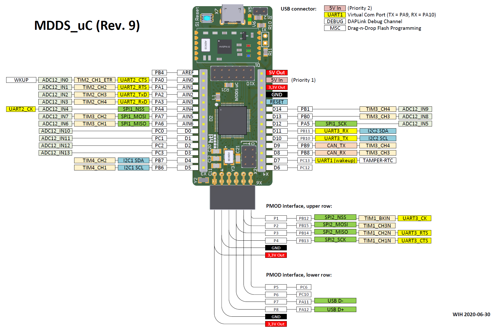
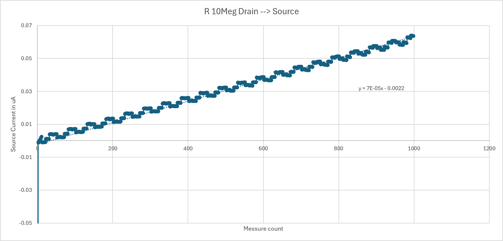
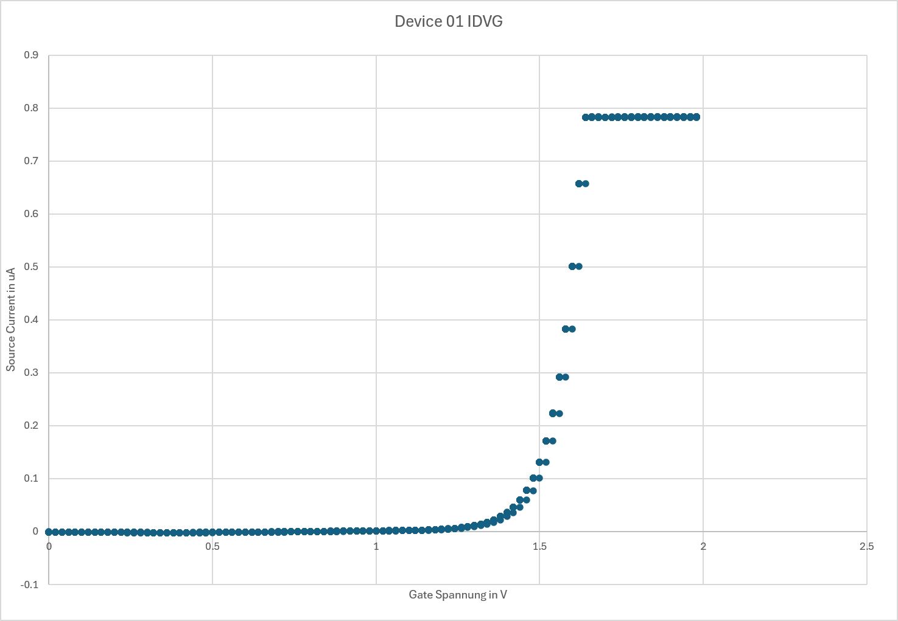

# Doku

### **_Spannungsversorgung_** 

Für ferschidenste ics oder uC worden LDOS gewählt weil niergents auf der PCB große kontinurliche ströme gebracuht werden. 
es werden 3,3V 5V und eine ± versorgung benötigt für die benötigten opvs. 
da die digital versorgung muss nicht shönsein da eigenlich nur spannung gebracuht wird nichts schönen doch die analog 5v versorgung sollte schön sein.
es werden hauptsächlich auf Psrr und auf low noise, nciht umbedingt high accuracy. 

### **_Drivers_** 

PINs.c

im PINs.c werden die GPIO pins konfiguriert. 

Der Port A: pin 1,2,4 werdenals Output push pullkofiguriert. PA1 ist die CS* für den DAC (AD5689) biem SPI bus. PA2 ist der konfigurations pin des DAC der zwischen einem gain von 1 und gain von 2 umschaltet, bei einem 1 auf PA2 ist der Gain 2, und damit ist die ausgangs range von 0V bis 5V, und bei PA2 low ist die range 0V bis 2.5V. PIN PA4 ist der CS* für den SPI bus des ADC ADS8681.
Port A: 5,6,7: Pin PA5,7 wird als Alternate funktion PP definiert für die SPI kommunikation. PIN PA6 idt für den MISO pin und ist für analog floating.

Port b: pin 1,4,7 sind im output push pull defniert, 1 ist für die Analog psu enable leitung und aktiviert die 5V versorgung. 4 ist für die Reset* leitung. 7 ist für die OPV enable leitung da die opv enleitungen nicht ganz funktioniern immer auf high lassen.
PB0 ist open drain ist für den One wire bus für in und out, auf diesem bus sind temp sensren und auch einen eeprom.

Portb PB8,9,11: die Ports PB8,9 sind open push pull welche auf die anzeige leds geleitet werden, 9 grün, 8 rot. Pin 11 ist für die 3,3V versorgung also immer high. 

port c: 0,1,2,3, sind immer gp pp und steuern die ralai spulen.

port C: 12 input pull up, ist die ADC* Alarm leitung diese liefert infos wenn ein alarm zustand beim adc auftritt. PC13 ist General purpus pp und ist für den ADC die Reset* leitung.

SPI.c

`#ifndef SPI_H
#define SPI_H

#include <stm32f10x.h>
#include <stdbool.h>

void spi1_init();

void spi1_set_baud(uint8_t baut);

void spi1_rx_dma(bool setting);

uint16_t spi1_transfer16(uint16_t tx_data);

uint8_t spi1_transfer8(uint8_t tx_data);

#endif`

die funmtion spi1 init wird die ganze regisdter konfig gesetzt. anfangs wird eine 8bit übertragung gesetz, es wird standart mäßig ein teiler von 16 verwendet. mit der funktion set baud kann der teiler gesetzt werden nach der tabelle:

	000: fPCLK/2
	001: fPCLK/4
	010: fPCLK/8
	011: fPCLK/16
	100: fPCLK/32
	101: fPCLK/64
	110: fPCLK/128
	111: fPCLK/256

die funktion rx_dma kann den dma für die z.b. adc auswetung geladen werden. die funktion spi transfer8 leitet einen transfer ein der daten die in einem uint8 angegeben wird, die funktion transfer 16 verwendet 2 mal die transfer 8 funktion beide funktionen sind blocking.

AD5689

Im `AD5689.c` wird der AD5689 DAC über SPI angesteuert. Die Initialisierung erfolgt mit `AD5689_init()`. Dabei wird der DAC zurückgesetzt, der Gain auf 1 gesetzt und der Ausgang zunächst auf 0 V gestellt.

Mit `AD5689_send_command()` werden die Befehle an den DAC übertragen. Dabei werden insgesamt 24 Bit übertragen. Das erste Byte enthält Befehl und Adresse, die nächsten zwei Bytes den 16-Bit-Datenwert.

Die Funktion `AD5689_set_Voltage()` wandelt eine gewünschte Spannung von 0 V bis 2,5 V in einen 16-Bit-DAC-Wert um. Werte außerhalb dieses Bereichs werden auf 0 V bzw. 2,5 V begrenzt. Der berechnete Wert wird anschließend an den ausgewählten DAC-Kanal übertragen.

Ads8681

Im `ADS8681.c` wird der ADS8681 ADC über SPI angesteuert.

`ADS8681_transfer_frame()` überträgt einen 32-Bit Frame. Dieser wird in zwei 16-Bit Übertragungen aufgeteilt. Vor der Übertragung wird `ADC_SPI_NCS` auf Low gesetzt und danach wieder auf High.

`ADS8681_send_Command_blocking()` erstellt den benötigten 32-Bit Frame aus Command, Registeradresse und Daten. Der Frame wird anschließend übertragen. Danach wird ein NOP-Frame gesendet, um die Antwort des ADC aus dem Sendepuffer auszulesen.

`ADS8681_init()` setzt den ADC zuerst über `ADC_NRESET` zurück. Danach wird über das Range-Select-Register der Eingangsbereich eingestellt. Im Code wird `ADS8681_RANGE_SEL_UP_1_25_VREF` verwendet.

`ADS8681_get_VOLT()` wandelt den 16-Bit Rohwert des ADC in eine Spannung um. Dabei wird `VREF = 4,096 V` verwendet. Durch die eingestellte bipolare Eingangsspannung ergibt sich ein Messbereich von ungefähr `-2,56 V bis +2,56 V`.

# Messung am 22.09.2026

Messaufbau mit platiene von Drain 1V über 2*8,5Meg Ohm wiederstände an den Source anschluss.
ergebniss sollten:

Ir = 1V/ 17Meg OHM = 58.8nA
dann am TIA:
Uout = Ir * Rf = 58.8nA * 10Meg = 0,588V

nach dem Dämpfer:
Ud = Utia * (10/33) = 0,178V

bei einer messung mit mustimeter kamm richtige spannung bei der adc auswertung kammen die falschen daten, anschluss messung mit oszi nach dem dämper eins mit DC 0,178V überlagertes 400mV pp 50 Hz signal. vermutung aufgrund des widerstands aufbeu und einstrahlung da, denn diese einstarhlung ~10meg verstärkt wird ist es sehr groß. _Abschirmung notwendig_ .

code für die testung:

`int main()
{
	PIN_init();
	set_up_uart1();
	spi1_init();
	
PER_33V_PSU_EN = 1;
ANALOG_5V_PSU_EN = 1;
OPV_PSU_EN = 1;

cal_Select_Reset = 0;
cal_Select_set = 0;
Range_Select_Reset = 0;
Range_Select_set = 0;

DAC_GAIN=0;
DAC_SPI_NCS = 1;
ADC_SPI_NCS = 1;

uart1_set_baud(9600);

{
uint16_t i;
for( i = 0; i < 10000; i++);
}

spi1_set_baud(7);

uart_put_string("UART TEST\r\n");

set_range_10meg();
reset_GND_Relai();
AD5689_set_Voltage(0,AD5689_ADDR_DAC_AB);

wait_ms(1000);

static double buffer[1000];

AD5689_set_Voltage(1.0, AD5689_ADDR_DAC_AB);
char uart_buffer[64];
	wait_ms(1000);
	int i;
for ( i = 0; i < 20; i++)
{
    /* Frame 1: Ergebnis verwerfen */
    ADC_SPI_NCS = 0;
    spi1_transfer16(0x0000);
    ADC_SPI_NCS = 1;

for (volatile int j = 0; j < 1000; j++);

/* Frame 2: Ergebnis verwenden */
ADC_SPI_NCS = 0;
uint16_t raw = spi1_transfer16(0x0000);
ADC_SPI_NCS = 1;

sprintf(
    uart_buffer,
    "%d,0x%04X,%.9f\r\n",
    i,
    raw,
    ADS8681_get_VOLT(raw)
);

uart_put_string(uart_buffer);
}`

# Messung am 23.09.2026

beid er messung im DIC raum wurde mit den giwnsteck die netzspannugnen der pcb eingestellt:

psu1: Ch1: +9V Ch2 -9V
psu2: Ch1: 5V Ch2 6,5V

dnach wurde mit bnc to banana kabeln wurden zuerst mit einem 10Meg weiderstand verbunden zwischen Drain und source anschlussen auf der PCB.

bei jedem messpunkt wird die spannung des Drain ausgangs geändert, zusehen ist das ein ~50Hz raushcen über dem signal liegt, müsste bei transienten messungen rausgemittelt werden oder versuchen mit dem case zu arbeiten. um es zu minimieren, es wurde versucht bei der IDVG messung mittels 10messwerte pro punkt.

Die idvg ab 1,5V gate spannung bis zu~1,7V ist die daten dichte punkte ziemlich gering.

# code 27.09
uint16_t Sps = 1000;
	
	static uint8_t buffer[2000];
	
	init_tim2(Sps);
	
	spi1_tx_dma_init();
	
	spi1_rx_dma_init();
	
	spi1_rx_dma(buffer, 2000);
	
	tim2_enable();
	
	/*static double buffer[1000];
	char uart_buffer[64];
	AD5689_set_Voltage(1.0, AD5689_ADDR_DAC_A);
	wait_ms(2000);
	LED_RED = 1;
	int i = 0;

	for(i = 0; i < 100; i++)
	{
		int j;

		for(j = 0; j < 10; j++)
		{
			ADC_SPI_NCS = 0;

			uint16_t raw = spi1_transfer16(0x0000);
			double volt = ADS8681_get_VOLT(raw);

			buffer[(i * 10) + j] = volt;

			ADC_SPI_NCS = 1;
		}

		DAC_SPI_NCS = 0;

		AD5689_set_Voltage(
			(i*0.02),
			AD5689_ADDR_DAC_B
		);
		wait_ms(100);
		DAC_SPI_NCS = 1;
		
	}
	
LED_GREEN = 1;

for(i = 0; i < 1000; i++) 
	{
		sprintf( 
		uart_buffer, 
		"%i,%.9f\r\n", 
		i, 
		buffer[i] 
		);
		uart_put_string(uart_buffer);
	}

	LED_GREEN = 0;
	LED_RED = 0;
	
	AD5689_set_Voltage(0,AD5689_ADDR_DAC_AB);
	
	while(1)
	{
	}
	
	*/
	/*
	spi1_set_baud(2);
	
	uart1_set_baud(9600);
		
	
	init_tim2(1,79); //uint8_t clk_div, uint16_t period_ticks
	
	spi1_rx_dma_init();
	
	uint8_t Adc_data_buffer [1000];
	
	spi1_rx_dma(Adc_data_buffer,1000);
	
	spi1_tx_dma_init();
	
	tim2_enable();
*/
/*	
	
	// Nutzung von uint16_t anstelle von uint32_t
	//uint16_t data = (uint16_t)((ADS8681_RANGE_SEL_UP_1_25_VREF & ADS8681_RANGE_SEL_MASK) << ADS8681_RANGE_SEL_SHIFT);
		
	// Befehl und Adresse direkt in einen uint16_t Wert kombinieren (statt uint8_t bytes[2])
	//uint16_t cmd = (uint16_t)(((ADS868X_SPI_COMMAND_WRITE_FULL << 1) | ((ADS868X_REGISTER_ADDRESS_RANGE_SEL >> 8) & 0x01)) << 8) 
	//             | (ADS868X_REGISTER_ADDRESS_RANGE_SEL & 0xFF);
	
	
	//AD5689_init();
	//AD5689_set_Voltage(3, AD5689_ADDR_DAC_AB);
	
	//AD5689_send_command(AD5689_CMD_WRITE_DAC, AD5689_ADDR_DAC_AB, 0xFFFF);

	reset_GND_Relai();
	
	//set_range_100k();
	wait_ms(1000);
	//set_range_10meg();
	
	
	//TO-DO: test dac
	
	
	spi1_transfer16(0x0000);// das kein befehl mer in wait ist;
	while(1)
	{
		uint16_t raw = spi1_transfer16(0x0000);
		uart_put_char(raw >> 8);
		uart_put_char(raw & 0x00ff);
	}
	
	uint8_t ADC_SPI1_BUFF [100];
	uint8_t ADC_SPI1_DUMMY = 0x00;
	
	spi1_tx_dma_init(&ADC_SPI1_DUMMY, 100);
	spi1_rx_dma_init(ADC_SPI1_BUFF, 100);
	
	uint8_t i = 0;
	for(i = 0; i < 100; i++)
	{
		uart_put_char(ADC_SPI1_BUFF[i]);
	}
	
	uart_put_string("EOS");
	
	
	char buffer[64];
	while(1){
	ADC_SPI_NCS = 0;
	uint16_t raw = spi1_transfer16(0x0000);
	double volt = ADS8681_get_VOLT(raw);
	ADC_SPI_NCS = 1;
	sprintf(buffer, "%.3f\r\n", volt);
	uart_put_string(buffer);
	}
	*/
	

