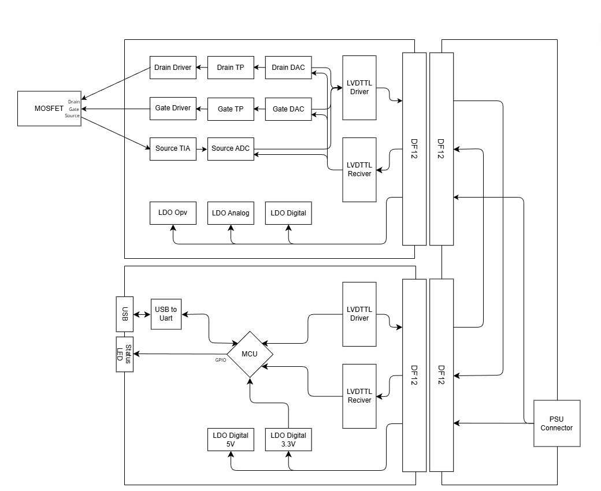
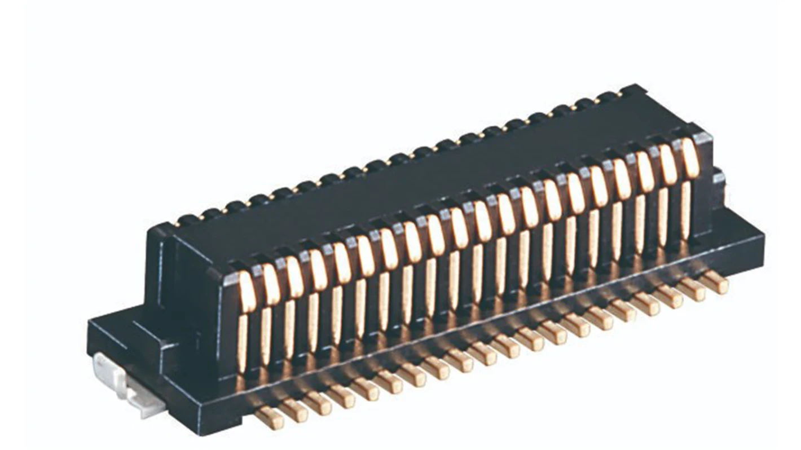
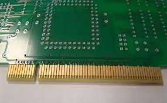
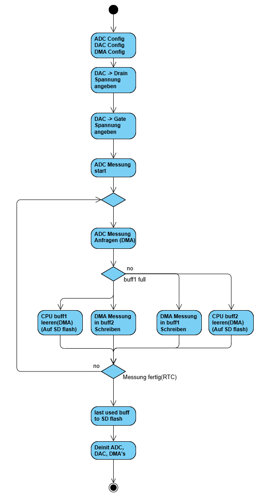
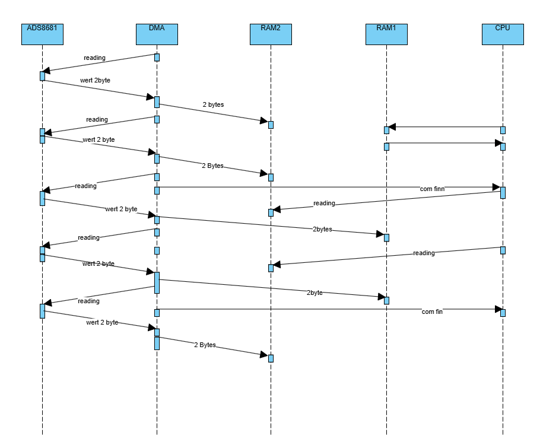
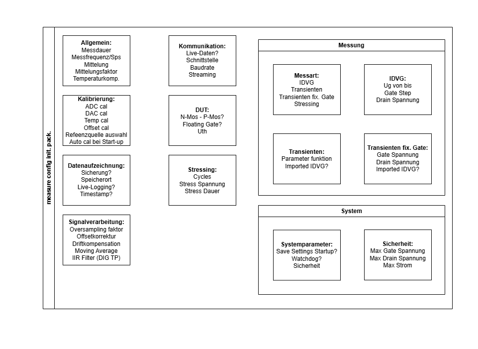

# DIP_PITCH

## Bauteile

### Digital
MPU ESP32 Wroom dev board
LVTTL Diff. Sender SN65LVDS1
LVTTL Diff. Transsever SN65LVDS2
LVTTL Diff. Quad Recifer DS90LV048A
LVTTL Diff. Quad Sender DS90LV047A

### Analog
OPV OPA928 ultra low Bias, low noise Opv
OPV LMC6001 low Bias, low noise Opv

### Converter
ADC ADS8681 16Bit, variable Input range, low glitch adc

### PSU
LDO LT3094EMSE#TRPBF low noise, low DropOut, Negative LDO
LDO LT3042EMSE#TRPBF low noise, low Dropout, Positive LDO

### BOX

Modulares Messgeräte-Chassis
https://www.metcase.de/
Instromenten gehäuse
so in der art etwas
Eigentlich ein euro card case und die platienen werden sich an die euro card halten

## Dokumentation

### Idee der Arbeit

Durch den Aufbau des MOSFET, liegt eine Isolierungsschicht am Balk, da solche Isolatoren fertigungsbedingt nicht perfekt hergestellt werden können enstehen unreinheiten, sogenannten ladungsfallen, denn bei einem stromfluss durch den nkanal kann durch den Tunneleffekt dazu kommen das siche ladungsfallen mit elektronen befüllt werden diese verringern durch ihre ladung die dicke des kanales und diese änderung äusert sich als RTN(Random Telegram Noise), dieses ist wiederum messbar. durch analyse des RTN lassen sich rückschlusse auf die Lebensdauer und beschaffenheit von solchen Halbleitern evaluieren.

### Bereichseingrenzung

Es soll eine messschaltung für die messung von nA strömen entworfen werden um die änderung im Strom durch das RTN zu vermessen. Auch die Ansteerung der anschlüsse (Drain, Gate), sollen ansteurbar sien zur automatischen erfassung von der IDVG kennlineie und einstellung des Source stromes. dies soll von einer MCU gstert und reguliert werden diese nimmt die messdaten auf und speichert diese bis zum ende der messung und sendet diese nach dem beendigen der messung an ein Auswerte gerät weiter leiten. 

Auf diesem Auswerte gerät sollen die messdaten entgegengenommen werden und analysiert werden(FFT, Transienten, Digital Tiefpassfilter).

### Motivation der Arbeit

war cool und so

## Arbeitsprogress

+ programmerstellung für die berechnung der TIA stufe
+ Block-Diagramm des Analog Messsystems
+ Auswahl des ADS8681
+ Besprechung mit TU-Kontakt
+ Programm lib erstellung für ADS8681 Kommunikation
+ Herstellung einer Test Kommunikations Platine
+ Entwicklung eines entwurfes für ein Modulares Messsystems

## Blockdiagramm Basic Idee

#### DF12:

#### Board Edge Conn

villeicht tausche ich die DF12 noch mit "Board Edge Connector" ist besser für frequentes ein und ausstecken. 

## Diff-Leitung Stecker Systems

Es sollten Diff-Leitungen verwendet werden um EMV zu verbessern und um das EM abstralen zu minmieren und da es sich um eine leitung über 20cm handelt sollte wegen der leitungslänge eine LVD (Low Voltage Diff) Driver und reciver verwedent werden. bei diesen Diff Drivern und Recivern handelt es sich um 100 Ohm systeme, die leitungen mussen entweder mit 100 Ohm abgeschlossen werden bevor die driver und reciver angeschalten werden, es muss eine logik her welche das eichschalten verbitet wenn kein reciver da ist.

## Spannungs Versorgung

Es werden die einzelnen LDO's auf die zuversorgenden Bereiche zu platzieren wenn es sich um spannungs Kritische Bauteile handelt,um Leitungs Wiederstand zu minimieren. Weiters soll auf die Rauschunterdrückung geachtetwerden um dadurch entstehenden Störungen zu minmieren. Zu überselgen ist ob ein Power good verwendet wird um davür zu sorgen das bei start up erst die spannung der bauteile steht dann daten gesendet werden.

## LVDS Impedanz anpassung

bei lvds muss auf die impedanz auf der pcb geachtet werden, die jetzigen lvds transiever sind ein 100 ohm prinzip.

## Messungs datenmengen

wir verwenden gerade so einen adc mit 16bit, der wunsch ist das wir die vollen 1Msps (1M messung pro sekunde) zu verwenden. das heist wir haben 2MByte pro sekunde, und wir wollen messungen bis zu 5min(300sek) daraus rechnet sich eine Messung hat eine daten menge von 600Mbyte(fuck viel, vieleicht so einen Flash chip oder eine sd karte oder so am besten über spi oder über ein anderes MCU protokoll), wir müssen das speichern, ein ansatz um die daten menge zu minimieren ist messungen zu mitteln(5 messungen zusammen addieren und später durch 5 rechenen) das ist aber auch mehr cpu lastig. 

Da auch die DAC angesteuert wrden müssen ist zu überlegenn die spi schnittstellen nicht alzu sehr zu belastgen.

## DMA

wir sollten einen dma verwenden um die CPU zu entlasten da die mit der controlle der umgebung und der steuerung der DAC und sonst beschäftigt ist. der DMA über nimmt die comm mit dem ADC speichert alle daten ins ram dort könnten wir einen weiteren ansetzten um die daten aus dem Ram auf einen flash speicher zu geben. die cpu sollte nicht das daten lifting übernehmen

## Cycle Buffer

ein cycle buffer oder ringbuffer oder einefach zwei buffer, wärend der eine buffer beschreiben wurde wird der andere z.b. auf die Flash zelle speicher, wenn der erste voll ist wird es wieder gecycled

## Software Calibrate

einmal nach dem start up der analog platine soll die option eines callibireirn begeben sein, einmal den ADC einlesen, eingang auf null legen offset merken, rausch messung zur bestimmung des signal noise distance temperatur messung und psu kontrolle.

## MCU Auswahl

der uC muss die anforderungen erfüllen: genug dma, SPI speed, genug ram für die buffer, und funktionalität der usb und rs232  verbindung. ambesten einen stm m4 oder einen esp. bei einem stm können wir schon leichter programmieren und einen esp nicht aber der ist bisschen leistungsfähiiger und leichter of board(auf eine eigene platine bringen) bringen.

## Messbox

ich hätte mir so was vorgestellt keine ahnung wie das heist bitte herausfinden.

## Software
### Software Data Structure Messure

