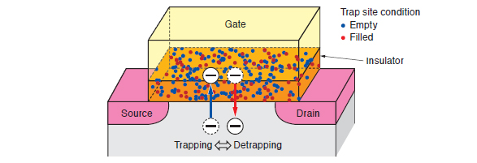
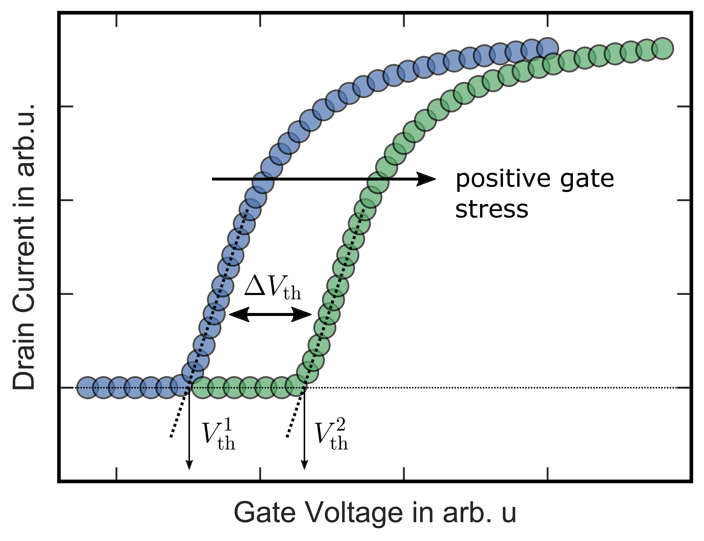
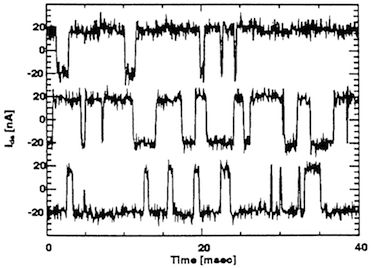
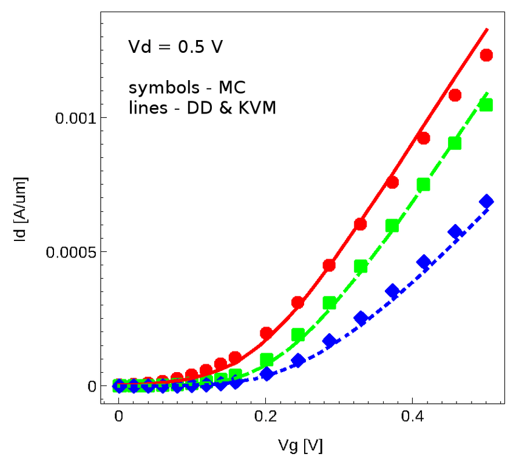

# Stressing-Measure

## Stressing
- TDDB .. Time-Dependent Dielectric Breakdown (zeitabhängiger dielektrischer Durchschlag)
- DIP .. Diplomarbeit
- FG .. Floating-Gate MOSFET
- DUT .. Device under Test
- ID-VG .. Drain-Strom über Gate-Spannung

Das Stressen ist eine der Hauptanalysen der DIP, wobei in der DIP 2 Arten von MOSFET's gestresst werden, ein "Normaler" und ein Floating-Gate.
Stressen heißt, dass das Gate mit hohen Spannungen (je nach MOSFET) zu versorgen ist. Während der Messung darf am Drain keine Spannung anliegen, da diese zu hohen Drain-Strom führt, welcher den Source TIA und den Drain Driver zerstören könnte. Bei einem normalen MOSFET soll das TDDB vermeseen werde, bei einem FG soll die Endurance vermessen werden. Die Messungen geben auskunft über die Lebensdauer und über das Verhalten des DUT

Das Stressen wird in Zyklen aufgebaut, z.b. es sollen 100 Stresszyklen durchgeführt werden, danach eine IDVG-Messung vorgenommen werden und anschließend weitere 100 Stresszyklen.
Durch das Stressen erwartet man sich folgenden Effekte in der Messung der ID-VG Kennlinie zu erkennen:

- Verschiebung der Threshold-Spannung
    - Das Aufladen von Traps (Fallen Oxid) beim TDDB. Traps sind Defekte in der Oxidschicht.
 

- Verschiebung der Kurve nach rechts bei einem N-Kanal.

- Leakage Current durch das Oxid
    - Durch das Stressen können lokale Schwachstellen enstehen-> Leakage steigt
    - kann im Subthreshold-Bereich den Strom steigern
- Reduzierung des Kanalstromes
    - wenn die Fallen aufgeladen sind, kann es zur Mobility Beeinträchtigung der Elektronen kommen
    - IDVG wird flacher

Messung eines FG

- Abbau des Tunneloxids
    - Jedes schreiben oder löschen erzeugt Traps und lokale Defekte
    - Diese Führen zur Threshold-Verschiebung im nicht beschriebenen Zustand, bzw. zum Ladungsverlust am FG
- Die Ladung am FG kann sich auch ohne Strom langsam ändern
- Vth-Drift: Der gleiche Program/Erase-Befehl führt nach 100 Zyklen zu einer anderen Threshold-Spannung, weil sich Fallen im Oxid angesammelt haben.
- Subthreshold-Leak: Leichte Erhöhung durch Oxid-Defekte.
- Programmier-/Lösch-Effizienz sinkt: Die Zelle benötigt evtl. höhere Spannung oder längere Zeit, um dieselbe Threshold-Spannung zu erreichen.
- Langzeit-Ausfallrisiko: Nach sehr vielen Zyklen (10⁴–10⁶) kann das Oxid durchbrechen → permanente Datenverluste.
- Durch das Analysiern der Threshold-Verschiebung und durch das steigen des RTN lassen sich Rückschlüsse auf die Lebenszeit schließen

## Measure

Die Größen welche vermessen werden sollen sind das RTN, IDVG und leak current. 

### RTN

Bei RTN handelt es sich um Random Telegraph Noise, bei diesen handelt es sich um Rauschen im nA Bereich. Es handelt sich um ein digital ähnliches Rauschen(deswegen Telegrapf). Dieses tritt auf beim Laden und Entladen von Fallen im Oxid. Die Häufigkeit von diesem Rauschen kann Rückschlüsse auf den Zustand des Oxides liefern, und damit auf die Auswirkungen des Stressens. Bei einem langen Stressen eines FG kann das Tunnel Oxid beschädigt werden und so kann vermehrt RTN vorkommen. 

### IDVG

Bei der IDVG handelt es sich um die Kennlinie eines MOSFET (der Drain-Strom über die Gate-Spannung).

Diese können durch einen Sweep über die Gain-Spannung erstellt werden. Bei dieser Kennlinie kann es zu Veränderungen durch verschiedenste Stresseffekte kommen. Die Threshold-Spannung kann durch das Stressen von geladenen Ladungsfallen erhöht werden, was die gesammte Kennlinie nach rechts verschiebt. Die Steigung kann ebenfalls durch das Stressen beeinflusst werden. Ebenfalls kann der Subthreshold-Strom durch Beschädigungen im Oxid, welche Leakage-Current zulassen, beeinflusst werden.

